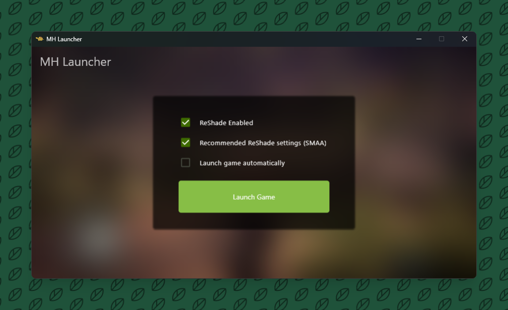

# MH Launcher

**MH Launcher is an open source application which enables the installation and injection of ReShade into Monster Hunter: World to enable better Anti-Aliasing and rendering.**

The default settings will enable SMAA which is a much better anti-aliasing technique than the inbuilt TAA and FXAA which make everything blurry.

ReShade will be injected regardless of how the game is launched as long as the ReShade setting is enabled and this launcher is running.